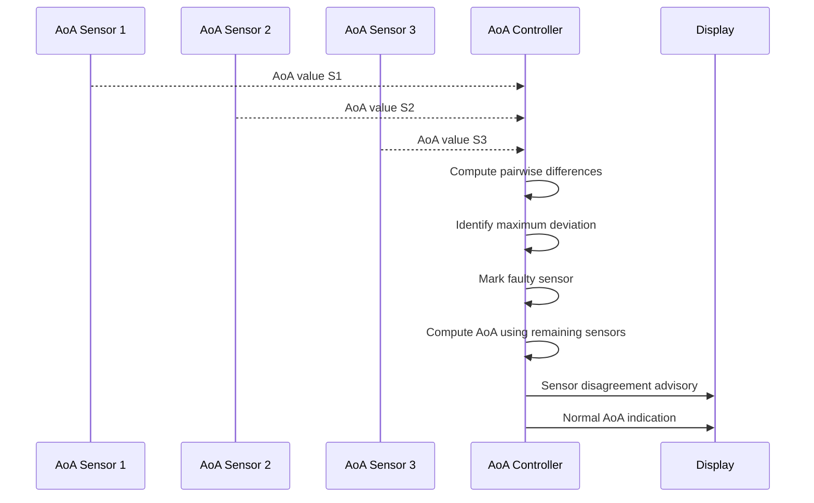
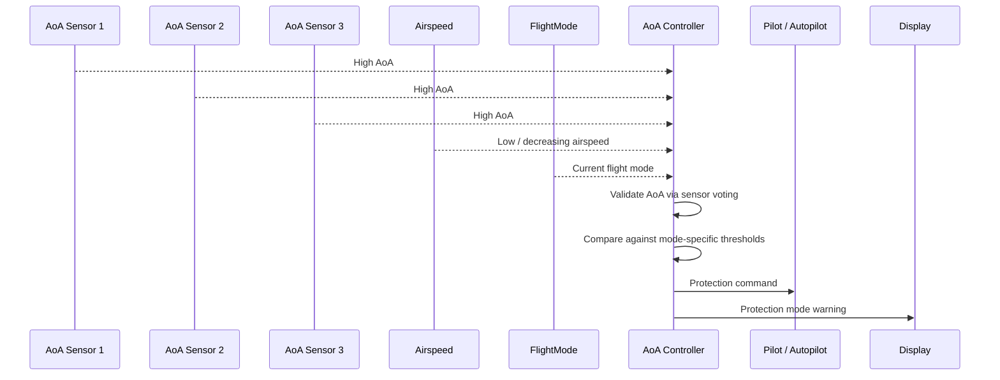

# Lab 3 – Individual Worksheet: V-Model and Traceability

> **Course:** CS G523 – Software for Embedded Systems  
> **Student Name:** Aditya Ashok Pise  
> **Project:** AoA Controller  
> **Team:** P2  

---

## Objective

This worksheet captures **individual reasoning** about how requirements are:
- realized through interactions (design),
- verified through tests.

This is an **individual exploratory artifact** and will be consolidated
at the group level.

The focus of this worksheet is to demonstrate how **safety-critical AoA controller requirements**
are translated into **runtime interactions** and validated using **design-level test artifacts**
following the V-Model approach.

---

## 1. Selected Requirements

The following two requirements are selected from the finalized **group Lab 2 submission**.
They were chosen because they represent **fault tolerance** and **automatic safety intervention**.

| Requirement ID | Requirement (brief description) |
|----------------|---------------------------------|
| R-1 | The system shall detect AoA sensor disagreement and safely reject faulty sensor data |
| R-2 | The system shall activate protection mode when AoA achieve safe thresholds |

---

## 2. Sequence Diagram(s)

Separate sequence diagrams are provided as the requirements correspond to
**different operational scenarios** of the AoA Controller.

---

### Sequence Diagram A (for R-1: Sensor Disagreement Handling)

This sequence diagram illustrates how the AoA Controller detects disagreement
among three AoA sensors, rejects the faulty sensor, and continues operation safely.



### Sequence Diagram B (for R-2) (Protection Mode Activation)



---

## 3. Test Artifacts

Each test artifact validates a **single requirement** and demonstrates  
a clear mapping between **requirement → interaction → verification**.

---

### Test for Requirement R-1 (Sensor Disagreement Detection)

- **Setup:**
  - System powered ON
  - Three AoA sensors connected or simulated
  - System operating in normal flight mode

- **Procedure:**
  1. Provide consistent AoA values from all three sensors
  2. Introduce an abnormal AoA value in one sensor
  3. Observe controller sensor validation logic

- **Pass criteria:**
  - Faulty sensor is correctly identified and ignored
  - AoA is computed using the remaining two sensors
  - System continues operation without entering protection mode

---

### Test for Requirement R-2 (Protection Mode Activation)

- **Setup:**
  - System operating normally
  - Valid AoA sensors and airspeed sensor available
  - Pilot/autopilot active

- **Procedure:**
  1. Gradually increase AoA beyond protection threshold
  2. Maintain low or decreasing airspeed
  3. Observe system response and control outputs

- **Pass criteria:**
  - Protection mode is activated
  - Warning is issued to pilot/autopilot
  - Protection command is generated without requiring pilot input
---

## Reflection (Optional)

Mapping sensor disagreement to safe continued operation required careful separation between **data validation** and **control logic**. For protection mode activation, the main challenge was ensuring that AoA alone does not trigger protection, which was addressed by gating decisions using airspeed and flight mode.

```
