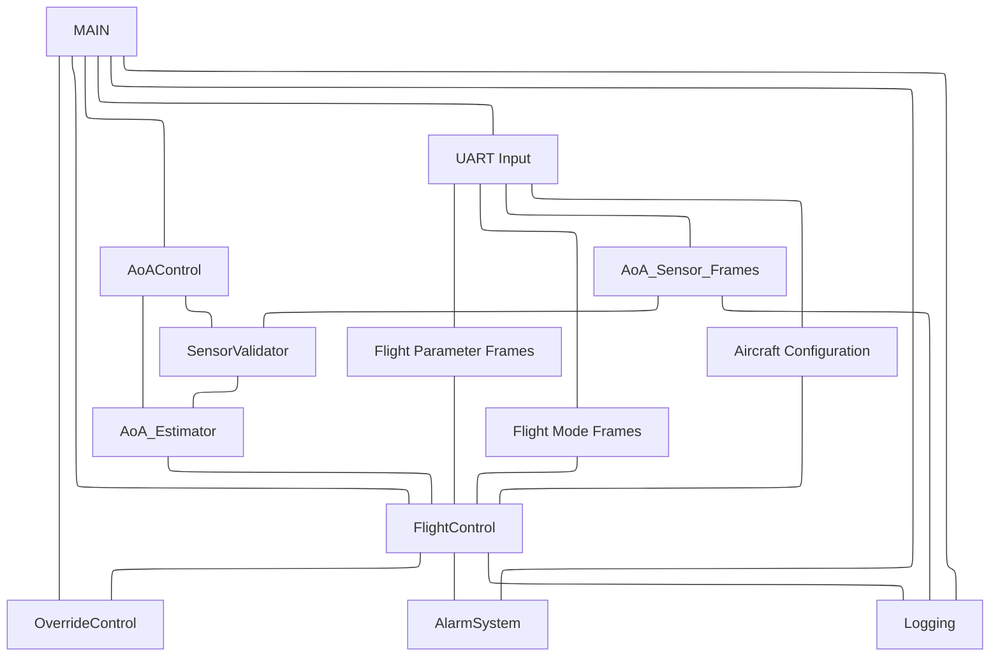
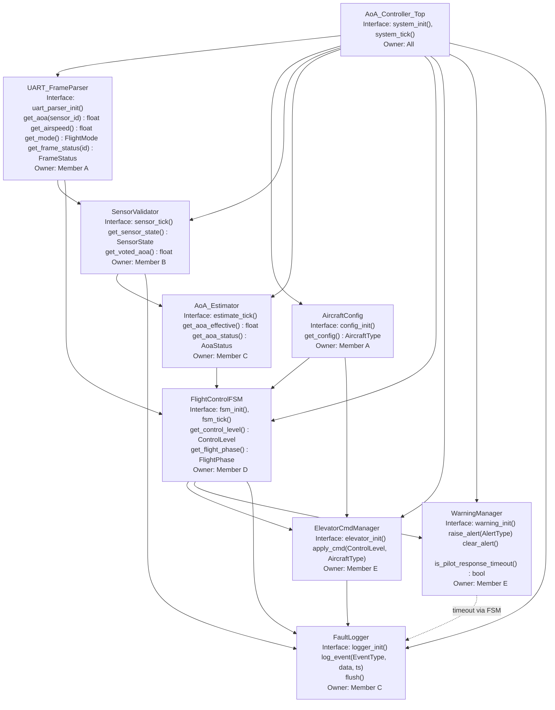

# Lab: Firmware Architecture Design
## AoA Controller – From Behavioral Models to Structured Implementation

> **Course:** CS G523 – Software for Embedded Systems
> **Project:** p2-aoa-controller – Aircraft Angle-of-Attack Safety Controller
> **Submission Type:** Group document with individual module ownership

---

## Alignment Note

The faculty specification (p2-aoa-controller) provides **three independent AoA sensors (S1, S2, S3)** arriving on independent UART frame streams alongside independent flight parameter and flight mode frames. Exact thresholds, state machine structure, sensor fusion policy, and control law equations are intentionally left to the team. This document reflects those constraints and records our design decisions explicitly. Our sensor voting algorithm uses pairwise difference analysis across all three sensors to identify and reject the outlier before computing the final AoA estimate.

---

## Step 1 – Exploratory Block Sketch

Preliminary software block decomposition derived from the project spec, UART frame definitions, and our behavioral statechart.


**Key observations from the sketch:**
- UART Parser is the sole hardware-facing data source — all other modules depend only on its clean interface.
- SensorValidator and AoA Estimator are deliberately separated: validation is a question of data integrity, estimation is a question of what value to use.
- FlightControlFSM is the sole decision-maker for authority transitions; it drives both actuation and alerting.
- FaultLogger is a pure sink with no outbound dependencies.

---

## Step 2 – Hierarchy of Control Diagram

**System control authority resides in:** `FlightControlFSM`
**System state is owned by:** `FlightControlFSM` (flight phase + control authority level)


- We are using the *Coordinated Controller Pattern*
- Assumption: Timestamp for both AoA sensor Frame and Flight Parameter Frame will always same.

---

## Step 3 – Dependency Constraints

### Allowed Dependency Directions

Data and control flow **strictly top-down**:

```
UART_FrameParser        AircraftConfig
       |                      |
       +-----------+----------+
                   |
           SensorValidator
                   |
            AoA_Estimator
                   |
         FlightControlFSM
           /             \
 ElevatorCmdMgr      WarningManager
           \             /
            FaultLogger
```

### Forbidden Dependencies

| Forbidden Direction | Reason |
|---------------------|--------|
| `FaultLogger` to any module | Logger is a pure sink; no outbound calls allowed |
| `ElevatorCmdManager` to `FlightControlFSM` | No upward feedback; commands are one-way |
| `WarningManager` to `FlightControlFSM` | Responses are external (pilot), not internal callbacks |
| `SensorValidator` to `FlightControlFSM` | Sensor layer must not know about control decisions |
| `UART_FrameParser` to any processing module | Parser is a pure data source |
| Any module reading another module's internal struct fields directly | All access via public interface functions only |

### Global State Policy

- **Zero global variables.** All persistent state lives in per-module context structs.
- `AircraftConfig` is loaded once at `config_init()` and is thereafter logically const.
- `AoA_EFFECTIVE` and `aoa_status` are exclusively owned by `AoA_Estimator` and published only through its getter interface.

### Cross-Module Data Sharing Policy

- All inter-module communication is via explicit function call at each scheduler tick.
- No shared memory regions or message queues in this iteration.
- `FaultLogger` is the only module callable from all others; this cross-cutting permission is limited strictly to the `log_event()` call.

---

## Step 4 – Behavioral Mapping Table

| Module | Related Statechart States | Related Transitions | Related Use Cases |
|--------|--------------------------|---------------------|-------------------|
| UART_FrameParser | — (infrastructure layer) | Drives all sensor-update and mode-change triggers | UC-1, UC-3 |
| AircraftConfig | — (configuration) | Loaded at boot; affects threshold lookup in FSM | UC-1 |
| SensorValidator | SensorsAgree, SensorsDisagree, SensorFailed, Failed | sensor_stale_or_missing, abs(S1-S2) > threshold, disagree_timeout, sensor_recovered | UC-1, UC-3 |
| AoA_Estimator | Implicit — produces AoA_EFFECTIVE or UNKNOWN | Transitions into/out of degraded estimation | UC-1, UC-3 |
| FlightControlFSM | TK/CL/CR/LD_Normal, _Caution, _Protection, _Override; outer TAKEOFF, CLIMB, CRUISE, LANDING | AoA approaching stall, almost stalling/overspeeding, stall happening, AoA return to safe, Flight_Mode_Changed, go_around_detected | UC-1, UC-2 |
| ElevatorCmdManager | Implied by _Protection and _Override active states | Entry/exit of Protection and Override | UC-2 |
| WarningManager | Implied by _Caution, _Protection, _Override states | Entry of Caution triggers alert; pilot response timer | UC-2 |
| FaultLogger | All failure states; all Override entries | SensorFailed, Failed, _Override entry | UC-3 |

---

## Step 5 – Interaction Summary

| Module | Calls | Called By | Shared Data? |
|--------|-------|-----------|--------------|
| UART_FrameParser | — | SensorValidator, FlightControlFSM | No |
| AircraftConfig | — | FlightControlFSM, ElevatorCmdManager | No |
| SensorValidator | UART_FrameParser, FaultLogger | AoA_Estimator | No |
| AoA_Estimator | SensorValidator | FlightControlFSM | No |
| FlightControlFSM | AoA_Estimator, UART_FrameParser, AircraftConfig, ElevatorCmdManager, WarningManager, FaultLogger | AoA_Controller_Top | No |
| ElevatorCmdManager | AircraftConfig, FaultLogger | FlightControlFSM | No |
| WarningManager | FaultLogger | FlightControlFSM | No |
| FaultLogger | — | All modules | No |

**Coupling observations:**
- `FlightControlFSM` has the highest fan-out (6 direct callees) — it is the architectural complexity hotspot and the highest-priority module for interface stability.
- `FaultLogger` has the highest fan-in (called by 5 modules) — its interface must be minimal and immutable.
- `UART_FrameParser` is called by two modules (SensorValidator and FSM directly). This is a deliberate shortcut: flight mode and airspeed are control context inputs, not sensor-integrity concerns, so routing them through SensorValidator would violate layer separation.

---

## Step 6 – Architectural Rationale

**Layered safety pipeline.** The architecture enforces a strict top-down dependency hierarchy from raw bytes to validated sensor state to fused estimate to safety decision to physical output. This makes data provenance explicit and traceable — a requirement for safety-critical embedded software — and prevents the circular reasoning that is dangerous in protection systems.

**Why SensorValidator and AoA_Estimator are separate.** Validation asks "can I trust this data?" Estimation asks "given what I trust, what is the AoA?" Merging them would couple data integrity logic with selection logic. The split also makes it straightforward to extend to three sensors later without touching the estimator interface.

**Why no global state.** Per-module context structs make each module's state explicit and enable isolated unit testing. This is important both for correctness now and for extension to an RTOS or multi-interrupt architecture later.

**Why FlightControlFSM is the sole authority arbiter.** It is the only module with simultaneous access to aircraft configuration, flight phase, airspeed, and AoA validity. Distributing authority decisions would require shared state and reintroduce the coupling the layered design is trying to eliminate.

**Why flight mode and airspeed bypass SensorValidator.** These are control context inputs, not AoA sensor integrity data. Routing them through SensorValidator would give the sensor layer knowledge of control logic.

**Acknowledged tradeoff.** The pipeline introduces one scheduler-tick of latency per layer. For a stall protection system this latency budget must be validated against the aircraft's minimum response time requirement (outside scope of this lab, noted for downstream verification).

---

## Step 7 – Task Split

| Member | Module(s) Owned |
|--------|-----------------|
| A | `UART_FrameParser`, `AircraftConfig` |
| Aditya A Pise | `SensorValidator`, `AoA_Estimator` |
| C | `FaultLogger` |
| D | `FlightControlFSM` |
| E | `ElevatorCmdManager`, `WarningManager` |

Each member is responsible for: interface definition, encapsulation rules, safeguards, and module-level tests for their assigned modules.

> Commit and push `docs/sections/architecture.md` at this stage before proceeding to individual specifications.

---

## Step 8 – Individual Module Specifications

---

### Module: UART_FrameParser

#### Purpose and Responsibilities


#### Inputs
- **Data received:**  
- **Assumptions about inputs:**  

#### Outputs
- **Data provided:**  
- **Guarantees provided:**  

#### Internal State (Encapsulation)
- **State variables:**  
- **Configuration parameters:**  
- **Internal invariants:**  

#### Initialization / Deinitialization
- **Init requirements:**  
- **Shutdown behavior:**  
- **Reset behavior:**  

#### Basic Protection Rules (Light Safeguards)


#### Module-Level Tests

| Test ID | Purpose | Stimulus | Expected Outcome |
|--------|--------|----------|-----------------|
|  |  |  |  |

---

### Module: AircraftConfig

#### Purpose and Responsibilities


#### Inputs
- **Events received:**  
- **Data received:**  
- **Assumptions about inputs:**  

#### Outputs
- **Data provided:**  
- **Guarantees provided:**  

#### Internal State (Encapsulation)
- **State variables:**  
- **Configuration parameters:**  
- **Internal invariants:**  

#### Initialization / Deinitialization
- **Init requirements:**  
- **Shutdown behavior:**  
- **Reset behavior:**  

#### Basic Protection Rules (Light Safeguards)


#### Module-Level Tests

| Test ID | Purpose | Stimulus | Expected Outcome |
|--------|--------|----------|-----------------|
|  |  |  |  |

---

### Module: SensorValidator

#### Purpose and Responsibilities


#### Design Decision: Three-Sensor Pairwise Outlier Rejection Algorithm


#### Inputs
- **Data received:**  
- **Assumptions about inputs:**  

#### Outputs
- **Events emitted:**  
- **Data provided:**  
- **Guarantees provided:**  

#### Internal State (Encapsulation)
- **State variables:**  
- **Configuration parameters:**  
- **Internal invariants:**  

#### Initialization / Deinitialization
- **Init requirements:**  
- **Shutdown / Reset behavior:**  

#### Basic Protection Rules (Light Safeguards)


#### Module-Level Tests

| Test ID | Purpose | Stimulus | Expected Outcome |
|--------|--------|----------|-----------------|
|  |  |  |  |

---

### Module: AoA_Estimator

#### Purpose and Responsibilities


#### Inputs
- **Data received:**  
- **Assumptions about inputs:**  

#### Outputs
- **Data provided:**  
- **Guarantees provided:**  

#### Internal State (Encapsulation)
- **State variables:**  
- **Configuration parameters:**  
- **Internal invariants:**  

#### Initialization / Deinitialization
- **Init requirements:**  
- **Shutdown / Reset behavior:**  

#### Basic Protection Rules (Light Safeguards)


#### Module-Level Tests

| Test ID | Purpose | Stimulus | Expected Outcome |
|--------|--------|----------|-----------------|
|  |  |  |  |

---

### Module: FlightControlFSM

#### Purpose and Responsibilities


#### Design Decision: Threshold Table Structure


#### Design Decision: UNKNOWN AoA Handling


#### Inputs
- **Events received:**  
- **Data received:**  
- **Assumptions about inputs:**  

#### Outputs
- **Commands issued:**  
- **Events emitted:**  
- **Guarantees provided:**  

#### Internal State (Encapsulation)
- **State variables:**  
- **Configuration parameters:**  
- **Internal invariants:**  

#### Initialization / Deinitialization
- **Init requirements:**  
- **Shutdown behavior:**  
- **Reset behavior:**  

#### Basic Protection Rules (Light Safeguards)


#### Module-Level Tests

| Test ID | Purpose | Stimulus | Expected Outcome |
|--------|--------|----------|-----------------|
|  |  |  |  |

---

### Module: ElevatorCmdManager

#### Purpose and Responsibilities


#### Inputs
- **Events received:**  
- **Assumptions about inputs:**  

#### Outputs
- **Commands issued:**  
- **Guarantees provided:**  

#### Internal State (Encapsulation)
- **State variables:**  
- **Configuration parameters:**  
- **Internal invariants:**  

#### Initialization / Deinitialization
- **Init requirements:**  
- **Shutdown behavior:**  
- **Reset behavior:**  

#### Basic Protection Rules (Light Safeguards)


#### Module-Level Tests

| Test ID | Purpose | Stimulus | Expected Outcome |
|--------|--------|----------|-----------------|
|  |  |  |  |

---

### Module: WarningManager

#### Purpose and Responsibilities


#### Inputs
- **Events received:**  
- **Assumptions about inputs:**  

#### Outputs
- **Events emitted:**  
- **Guarantees provided:**  

#### Internal State (Encapsulation)
- **State variables:**  
- **Configuration parameters:**  
- **Internal invariants:**  

#### Initialization / Deinitialization
- **Init requirements:**  
- **Shutdown / Reset behavior:**  

#### Basic Protection Rules (Light Safeguards)


#### Module-Level Tests

| Test ID | Purpose | Stimulus | Expected Outcome |
|--------|--------|----------|-----------------|
|  |  |  |  |

---

### Module: FaultLogger

#### Purpose and Responsibilities


#### Inputs
- **Events received:**  
- **Assumptions about inputs:**  

#### Outputs
- **Commands issued:**  
- **Guarantees provided:**  

#### Internal State (Encapsulation)
- **State variables:**  
- **Configuration parameters:**  
- **Internal invariants:**  

#### Initialization / Deinitialization
- **Init requirements:**  
- **Shutdown behavior:**  
- **Reset behavior:**  

#### Basic Protection Rules (Light Safeguards)


#### Module-Level Tests

| Test ID | Purpose | Stimulus | Expected Outcome |
|--------|--------|----------|-----------------|
|  |  |  |  |

---

## Step 9 – Updated Hierarchy Diagram

*(Each member updates this diagram for their modules after finalizing specifications.)*



---

## Step 10 – Architectural Risk Statement

### Risk: Outlier Score Tie in Pairwise Rejection When Two Sensors Fail Simultaneously

**Why it is a risk:**
The pairwise outlier rejection algorithm works correctly when exactly one sensor diverges — it unambiguously identifies the outlier via disagreement scores. However, if two sensors fail or drift simultaneously in opposite directions (e.g., S1 reads high, S3 reads low, S2 is correct), all three pairwise differences will be large and the disagreement scores will not clearly single out one outlier. In this case the algorithm reaches a DISAGREE state with no valid outlier to remove. After `DISAGREE_TIMEOUT_MS` it escalates to FAILED, but during the timeout window `voted_aoa` is unavailable, which forces the FSM into minimum Caution authority. For a double sensor fault scenario during a critical flight phase (e.g., approach), this could be disruptive.

A subtler variant is a partial tie in disagreement scores: two sensors have identical scores (e.g., S1=10°, S2=14°, S3=18° with symmetric differences). The algorithm must have a documented, deterministic tie-breaking rule — the absence of one creates non-deterministic behavior, which is unacceptable in safety-critical firmware.

**How it might be mitigated later:**
Define and document an explicit tie-breaking rule now (e.g., when scores are equal within a tolerance, exclude the sensor with the highest absolute AoA reading, as it represents the worst-case stall risk). This rule must be tested explicitly (SV-03). For the double-fault scenario, a future enhancement could use a rate-of-change filter: a sensor whose AoA value is changing faster than the physical aircraft can maneuver is more likely a failed sensor than a real reading, providing a secondary basis for exclusion beyond instantaneous magnitude comparison.

---

## Change Log

| Date | Change | Author |
|------|--------|--------|
| 24/02/2026 | intial version | Project Team |
