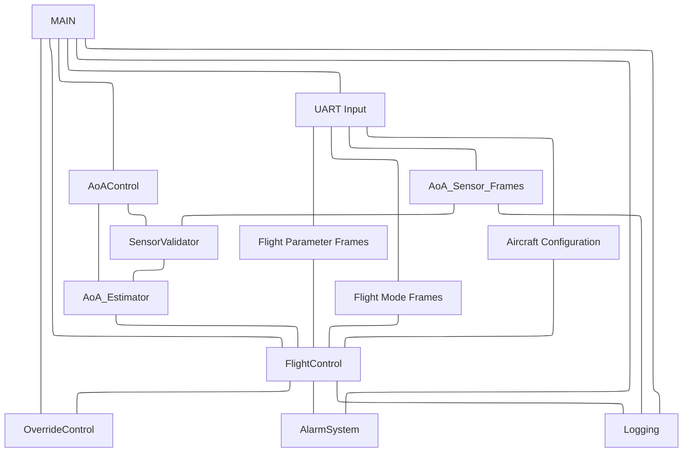
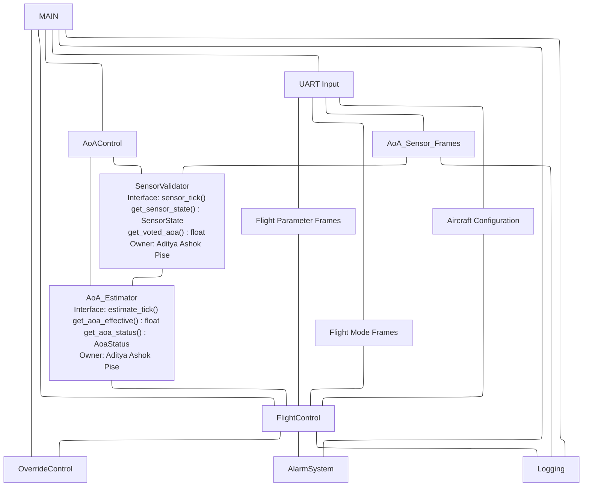

# Lab: Firmware Architecture Design  
## From Behavioral Models to Structured Implementation

> **Name:** Aditya Ashok Pise (2025H1120148P)
> **Project:** P2 - AoA Controller 
> **Course:** CS G523 – Software for Embedded Systems  
> **Submission Type:** Group document with individual module ownership  
> **Objective:** Translate behavioral models into disciplined firmware structure

---

## Purpose of This Lab

By the end of this lab, your team will produce:

- A justified architectural structure
- A hierarchical control decomposition
- Explicit dependency constraints
- Module ownership and specifications
- Light structural safeguards
- Module-level test definitions

## Submission
Use the template provided [here](https://github.com/gsaurabhr-teaching/csg523-material/blob/main/labs/lab4-group-sample.md) to complete the tasks given below. Then add it to your repository under `docs/sections/architecture.md`.

---

## Step 1 – Identify Software Blocks (Exploratory Sketch)

Create a preliminary block diagram (hand-drawn or digital): Attached Below

This sketch should:

- Identify major software blocks
- Show rough relationships
- Be exploratory (no need for polish)

Purpose: Encourage unconstrained architectural thinking before formalization.

---

## Step 2 – Hierarchy of Control Diagram (Mermaid)



---

## Step 3 – Dependency Constraints

### Allowed Dependency Directions

Data and control flow **strictly top-down**:

```
UART_FrameParser        AircraftConfig
       |                      |
       +-----------+----------+
                   |
           SensorValidator
                   |
            AoA_Estimator
                   |
         FlightControlFSM
           /             \
 ElevatorCmdMgr      WarningManager
           \             /
            FaultLogger
```

### Forbidden Dependencies

| Forbidden Direction | Reason |
|---------------------|--------|
| `FaultLogger` to any module | Logger is a pure sink; no outbound calls allowed |
| `ElevatorCmdManager` to `FlightControlFSM` | No upward feedback; commands are one-way |
| `WarningManager` to `FlightControlFSM` | Responses are external (pilot), not internal callbacks |
| `SensorValidator` to `FlightControlFSM` | Sensor layer must not know about control decisions |
| `UART_FrameParser` to any processing module | Parser is a pure data source |
| Any module reading another module's internal struct fields directly | All access via public interface functions only |

### Global State Policy

- **Zero global variables.** All persistent state lives in per-module context structs.
- `AircraftConfig` is loaded once at `config_init()` and is thereafter logically const.
- `AoA_EFFECTIVE` and `aoa_status` are exclusively owned by `AoA_Estimator` and published only through its getter interface.

### Cross-Module Data Sharing Policy

- All inter-module communication is via explicit function call at each scheduler tick.
- No shared memory regions or message queues in this iteration.
- `FaultLogger` is the only module callable from all others; this cross-cutting permission is limited strictly to the `log_event()` call.

---

## Step 4 – Behavioral Mapping Table

| Module | Related Statechart States | Related Transitions | Related Use Cases |
|--------|--------------------------|---------------------|-------------------|
| UART_FrameParser | — (infrastructure layer) | Drives all sensor-update and mode-change triggers | UC-1, UC-3 |
| AircraftConfig | — (configuration) | Loaded at boot; affects threshold lookup in FSM | UC-1 |
| SensorValidator | SensorsAgree, SensorsDisagree, SensorFailed, Failed | sensor_stale_or_missing, abs(S1-S2) > threshold, disagree_timeout, sensor_recovered | UC-1, UC-3 |
| AoA_Estimator | Implicit — produces AoA_EFFECTIVE or UNKNOWN | Transitions into/out of degraded estimation | UC-1, UC-3 |
| FlightControlFSM | TK/CL/CR/LD_Normal, _Caution, _Protection, _Override; outer TAKEOFF, CLIMB, CRUISE, LANDING | AoA approaching stall, almost stalling/overspeeding, stall happening, AoA return to safe, Flight_Mode_Changed, go_around_detected | UC-1, UC-2 |
| ElevatorCmdManager | Implied by _Protection and _Override active states | Entry/exit of Protection and Override | UC-2 |
| WarningManager | Implied by _Caution, _Protection, _Override states | Entry of Caution triggers alert; pilot response timer | UC-2 |
| FaultLogger | All failure states; all Override entries | SensorFailed, Failed, _Override entry | UC-3 |

---

## Step 5 – Interaction Summary

| Module | Calls | Called By | Shared Data? |
|--------|-------|-----------|--------------|
| UART_FrameParser | — | SensorValidator, FlightControlFSM | No |
| AircraftConfig | — | FlightControlFSM, ElevatorCmdManager | No |
| SensorValidator | UART_FrameParser, FaultLogger | AoA_Estimator | No |
| AoA_Estimator | SensorValidator | FlightControlFSM | No |
| FlightControlFSM | AoA_Estimator, UART_FrameParser, AircraftConfig, ElevatorCmdManager, WarningManager, FaultLogger | AoA_Controller_Top | No |
| ElevatorCmdManager | AircraftConfig, FaultLogger | FlightControlFSM | No |
| WarningManager | FaultLogger | FlightControlFSM | No |
| FaultLogger | — | All modules | No |

**Coupling observations:**
- `FlightControlFSM` has the highest fan-out (6 direct callees) — it is the architectural complexity hotspot and the highest-priority module for interface stability.
- `FaultLogger` has the highest fan-in (called by 5 modules) — its interface must be minimal and immutable.
- `UART_FrameParser` is called by two modules (SensorValidator and FSM directly). This is a deliberate shortcut: flight mode and airspeed are control context inputs, not sensor-integrity concerns, so routing them through SensorValidator would violate layer separation.

---

## Step 6 – Architectural Rationale

**Layered safety pipeline.** The architecture enforces a strict top-down dependency hierarchy from raw bytes to validated sensor state to fused estimate to safety decision to physical output. This makes data provenance explicit and traceable — a requirement for safety-critical embedded software — and prevents the circular reasoning that is dangerous in protection systems.

**Why SensorValidator and AoA_Estimator are separate.** Validation asks "can I trust this data?" Estimation asks "given what I trust, what is the AoA?" Merging them would couple data integrity logic with selection logic. The split also makes it straightforward to extend to three sensors later without touching the estimator interface.

**Why no global state.** Per-module context structs make each module's state explicit and enable isolated unit testing. This is important both for correctness now and for extension to an RTOS or multi-interrupt architecture later.

**Why FlightControlFSM is the sole authority arbiter.** It is the only module with simultaneous access to aircraft configuration, flight phase, airspeed, and AoA validity. Distributing authority decisions would require shared state and reintroduce the coupling the layered design is trying to eliminate.

**Why flight mode and airspeed bypass SensorValidator.** These are control context inputs, not AoA sensor integrity data. Routing them through SensorValidator would give the sensor layer knowledge of control logic.

**Acknowledged tradeoff.** The pipeline introduces one scheduler-tick of latency per layer. For a stall protection system this latency budget must be validated against the aircraft's minimum response time requirement (outside scope of this lab, noted for downstream verification).

---

## Step 7 – Task Split

| Member | Module(s) Owned |
|--------|-----------------|
| Siddharth | `UART_FrameParser`, `AircraftConfig` |
| Aditya A Pise | `SensorValidator`, `AoA_Estimator` |
| Srishti | `FaultLogger` |
| Vishrut | `FlightControlFSM` |
| Aniket | `ElevatorCmdManager`, `WarningManager` |

Each member is responsible for: interface definition, encapsulation rules, safeguards, and module-level tests for their assigned modules.

> Commit and push `docs/sections/architecture.md` at this stage before proceeding to individual specifications.

---

## Step 8 – Individual Module Specifications

---


### Module: SensorValidator

#### Purpose and Responsibilities
Validate AoA readings from S1, S2, and S3. Implement the sensor state machine: detect disagreement, staleness, and failure across all three sensors. Apply the pairwise outlier rejection algorithm to produce a conservatively voted AoA value, or signal FAILED when no reliable estimate is possible.

#### Design Decision: Three-Sensor Pairwise Outlier Rejection Algorithm

With three sensors we can identify a divergent outlier rather than blindly trusting any single reading. The algorithm runs every tick on the set of currently valid (non-stale, non-missing) sensors:

**Step 1 — Compute all pairwise differences:**
```
diff_12 = abs(S1 - S2)
diff_13 = abs(S1 - S3)
diff_23 = abs(S2 - S3)
```

**Step 2 — Identify the outlier:**
The sensor that participates in the two largest differences is the outlier — it is the one that disagrees most with both of the other two. Specifically, assign each sensor a "disagreement score" equal to the sum of the two differences it participates in:

```
score_S1 = diff_12 + diff_13
score_S2 = diff_12 + diff_23
score_S3 = diff_13 + diff_23
```

The sensor with the highest score is flagged as the outlier and excluded from the vote.

**Step 3 — Compute voted AoA:**
Average the two remaining sensors. This is `voted_aoa`.

**Step 4 — Classify state:**

| Valid sensors | Max pairwise diff of remaining pair | State |
|---|---|---|
| 3 | ≤ DISAGREE_THRESHOLD | AGREE |
| 3 | > DISAGREE_THRESHOLD (outlier excluded) | DEGRADED (outlier removed, 2 agree) |
| 3 | All pairs > DISAGREE_THRESHOLD | DISAGREE (no clear outlier; all diverge) |
| 2 | ≤ DISAGREE_THRESHOLD | DEGRADED (one sensor lost) |
| 2 | > DISAGREE_THRESHOLD | DISAGREE |
| 1 | — | DEGRADED (single sensor; no cross-check) |
| 0 | — | FAILED |

The DISAGREE state (all three sensors mutually diverging) escalates to FAILED after `DISAGREE_TIMEOUT_MS`.

**Hysteresis:** The transition from DISAGREE back to AGREE or DEGRADED requires the pair difference to fall below `DISAGREE_CLEAR_THRESHOLD` (< `DISAGREE_THRESHOLD`) to prevent oscillation.

**Example:** 
```
(Temporary)
S1 = 10.1°,  S2 = 10.4°,  S3 = 18.7°

diff_12 = 0.3°,  diff_13 = 8.6°,  diff_23 = 8.3°

score_S1 = 0.3 + 8.6 = 8.9   ← highest → S1 is NOT the outlier (S1 and S2 agree)
score_S2 = 0.3 + 8.3 = 8.6
score_S3 = 8.6 + 8.3 = 16.9  ← highest → S3 is the OUTLIER

voted_aoa = avg(S1, S2) = 10.25°   State = DEGRADED
```

#### Inputs
- **Data received:** `aoa[3]`, `frame_status[3]` from UART_FrameParser (each tick)
- **Assumptions about inputs:** Frames are independently updated; partial updates (1 or 2 sensors fresh) are normal and handled gracefully.

#### Outputs
- **Events emitted:** `EVT_SENSORS_AGREE`, `EVT_SENSORS_DISAGREE`, `EVT_SENSOR_DEGRADED`, `EVT_SENSOR_FAILED`, `EVT_SENSOR_RECOVERED`, `EVT_OUTLIER_DETECTED` (includes which sensor was rejected)
- **Data provided:** `sensor_state` (AGREE / DEGRADED / DISAGREE / FAILED), `voted_aoa` (float, valid when state is AGREE or DEGRADED), `outlier_sensor_id` (0/1/2 or NONE)
- **Guarantees provided:** `voted_aoa` is never used by callers when `sensor_state == FAILED`. The outlier rejection is recomputed every tick — a recovered sensor is automatically re-included.

#### Internal State (Encapsulation)
- **State variables:** `sensor_state`, `disagree_start_ms`, `per_sensor_valid[3]`, `outlier_id`
- **Configuration parameters:** `DISAGREE_THRESHOLD` (degrees), `DISAGREE_CLEAR_THRESHOLD` (degrees), `DISAGREE_TIMEOUT_MS`
- **Internal invariants:** `voted_aoa` is only written when at least two valid sensors remain after outlier exclusion, or exactly one valid sensor remains (DEGRADED). `outlier_id` is NONE when all three sensors agree or fewer than 3 are valid.

#### Initialization / Deinitialization
- **Init requirements:** `UART_FrameParser` must be initialized first.
- **Shutdown / Reset behavior:** Reset state to initial; clear disagree timer; clear outlier_id.

#### Basic Protection Rules (Light Safeguards)
- Reject AoA values outside physical range before including in pairwise computation.
- Stale and missing sensors are excluded from the valid set before running the algorithm.
- All transitions to FAILED log an event immediately with the causal condition.
- `EVT_OUTLIER_DETECTED` is logged each time a new outlier is identified, including the sensor ID and its divergence magnitude.
- Hysteresis prevents rapid DISAGREE/AGREE oscillation.

#### Module-Level Tests

| Test ID | Purpose | Stimulus | Expected Outcome |
|---------|---------|----------|-----------------|
| SV-01 | All three agree | S1=10.0°, S2=10.2°, S3=10.1° (all pairs within threshold) | AGREE; voted_aoa = avg(S1,S2,S3) |
| SV-02 | Single outlier detected | S1=10.0°, S2=10.3°, S3=18.7° | S3 flagged as outlier; DEGRADED; voted_aoa = avg(S1,S2) |
| SV-03 | Outlier score tie-breaking | Two sensors have equal disagreement scores | Conservative rule applied (e.g., highest AoA sensor excluded); documented behavior |
| SV-04 | All three disagree (no clear outlier) | S1=10°, S2=15°, S3=20° (all pairs > threshold) | State = DISAGREE; timer starts |
| SV-05 | DISAGREE timeout | DISAGREE persists > DISAGREE_TIMEOUT_MS | State = FAILED; event logged |
| SV-06 | DISAGREE clears (hysteresis) | All pair diffs fall below DISAGREE_CLEAR_THRESHOLD | State returns to AGREE |
| SV-07 | One sensor stale | S2 frame STALE | Algorithm runs on S1 and S3; State = DEGRADED |
| SV-08 | Two sensors stale | S2 and S3 STALE | State = DEGRADED; S1 used alone (no cross-check) |
| SV-09 | All sensors stale | All frames STALE | State = FAILED; UNKNOWN output |
| SV-10 | Outlier recovers | S3 was outlier, now returns in-range | S3 re-included; state re-evaluated to AGREE if all now agree |
| SV-11 | Outlier event logged | S3 flagged as outlier | EVT_OUTLIER_DETECTED logged with sensor ID and divergence |
| SV-12 | Physical range rejection | S2=200° | S2 excluded before pairwise calc; treated as invalid |

---

### Module: AoA_Estimator

#### Purpose and Responsibilities
Translate SensorValidator output into a single cleanly-typed `AoA_EFFECTIVE` with an explicit validity status. Acts as the interface boundary between sensor-world and control-world.

#### Inputs
- **Data received:** `sensor_state`, `voted_aoa` from SensorValidator
- **Assumptions about inputs:** SensorValidator tick completes before AoA_Estimator tick each cycle.

#### Outputs
- **Data provided:** `aoa_effective` (float), `aoa_status` (`AOA_VALID` / `AOA_UNKNOWN`)
- **Guarantees provided:** `AOA_VALID` only when `sensor_state` is AGREE or DEGRADED. `AOA_UNKNOWN` when FAILED.

#### Internal State (Encapsulation)
- **State variables:** `aoa_effective`, `aoa_status`
- **Configuration parameters:** Physical AoA clamp range (sanity ceiling/floor)
- **Internal invariants:** `aoa_status == AOA_UNKNOWN` iff `sensor_state == FAILED`.

#### Initialization / Deinitialization
- **Init requirements:** SensorValidator must be initialized first.
- **Shutdown / Reset behavior:** Set `aoa_status = AOA_UNKNOWN`.

#### Basic Protection Rules (Light Safeguards)
- Never propagate a value when `sensor_state == FAILED`.
- Clamp `aoa_effective` to physical range as a final sanity check; log if clamping was applied.
- Log to FaultLogger if UNKNOWN persists beyond a configurable duration.

#### Module-Level Tests

| Test ID | Purpose | Stimulus | Expected Outcome |
|---------|---------|----------|-----------------|
| AE-01 | Valid pass-through (AGREE) | `sensor_state=AGREE`, `voted_aoa=15.5°` | `aoa_effective=15.5`, `aoa_status=AOA_VALID` |
| AE-02 | Valid pass-through (DEGRADED) | `sensor_state=DEGRADED`, `voted_aoa=12.0°` | `aoa_effective=12.0`, `aoa_status=AOA_VALID` |
| AE-03 | UNKNOWN on FAILED | `sensor_state=FAILED` | `aoa_status=AOA_UNKNOWN` |
| AE-04 | Sanity clamp applied | `voted_aoa=200°` | Clamped to physical max; fault logged |
| AE-05 | Sustained UNKNOWN logging | UNKNOWN for > threshold duration | Logged to FaultLogger |

---

## Step 9 – Update Hierarchy Diagram

After module specifications are completed:



---

## Step 10 – Architectural Risk Statement

Identify one architectural risk.

Explain:

**Why it is a risk:**
The pairwise outlier rejection algorithm works correctly when exactly one sensor diverges — it unambiguously identifies the outlier via disagreement scores. However, if two sensors fail or drift simultaneously in opposite directions (e.g., S1 reads high, S3 reads low, S2 is correct), all three pairwise differences will be large and the disagreement scores will not clearly single out one outlier. In this case the algorithm reaches a DISAGREE state with no valid outlier to remove. After `DISAGREE_TIMEOUT_MS` it escalates to FAILED, but during the timeout window `voted_aoa` is unavailable, which forces the FSM into minimum Caution authority. For a double sensor fault scenario during a critical flight phase (e.g., approach), this could be disruptive.

A subtler variant is a partial tie in disagreement scores: two sensors have identical scores (e.g., S1=10°, S2=14°, S3=18° with symmetric differences). The algorithm must have a documented, deterministic tie-breaking rule — the absence of one creates non-deterministic behavior, which is unacceptable in safety-critical firmware.

**How it might be mitigated later:**
Define and document an explicit tie-breaking rule now (e.g., when scores are equal within a tolerance, exclude the sensor with the highest absolute AoA reading, as it represents the worst-case stall risk). This rule must be tested explicitly (SV-03). For the double-fault scenario, a future enhancement could use a rate-of-change filter: a sensor whose AoA value is changing faster than the physical aircraft can maneuver is more likely a failed sensor than a real reading, providing a secondary basis for exclusion beyond instantaneous magnitude comparison.

---

## Submission Checklist

- [] Exploratory block sketch included
- [ ] Architectural rationale provided
- [ ] Hierarchical control diagram complete
- [ ] Dependency constraints defined
- [ ] Behavioral mapping table complete
- [ ] Interaction summary table complete
- [ ] Task split defined
- [ ] Individual module specifications complete
- [ ] Hierarchy diagram updated
- [ ] Architectural risk identified

---

A weak architecture here will create persistent downstream problems.
